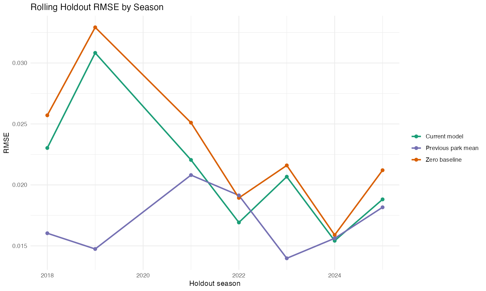
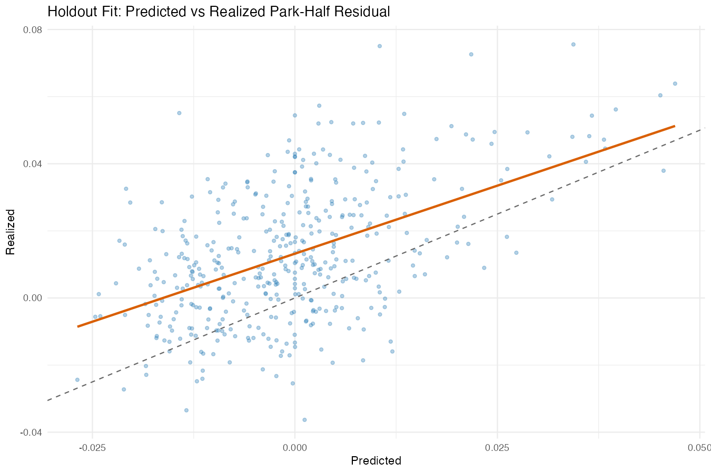
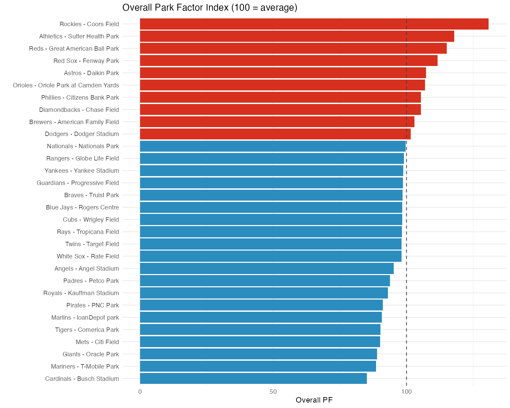
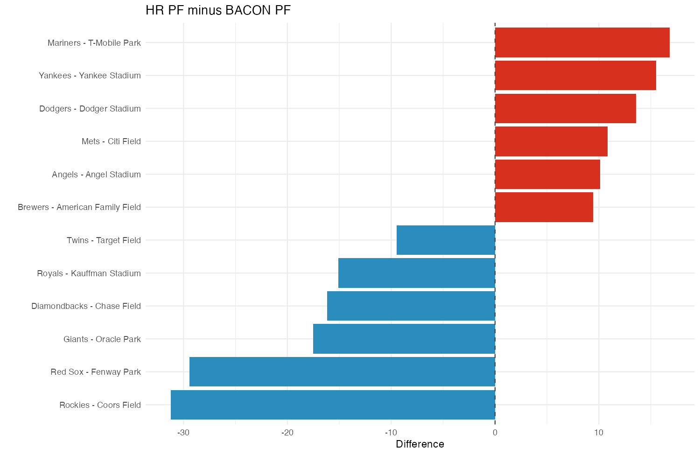
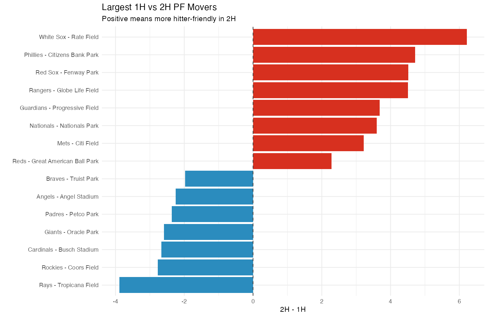

# Building Fantasy-Forward Park Factors from Statcast Batted-Ball Residuals

_Generated: 2026-03-02 10:53 PST_

## Executive Summary

This version is built for fantasy pitcher streaming decisions. It explicitly separates hit environment (BACON) and home-run environment, while controlling for player/team quality and team defense.

- Data scope: seasons 
2015,2016,2017,2018,2019,2021,2022,2023,2024,2025
- Excluded season: 
2020
- BBE rows modeled: 1,634,138
- Weighted holdout RMSE: model=0.0211, zero=0.0231, prior-park=0.0169
- Weighted holdout correlation: model=0.530, prior-park=0.557
- Calibration slope (weighted mean): 0.810
- Invariance corr with home-team offense: -0.022
- Invariance corr with home-team defense: 0.031

## Data and Construction

We use Statcast BBE-level records and model event residuals as actual minus expected outcomes.

Primary residual targets:

- `resid = wOBAcon - xwOBAcon`
- `bacon_resid = hit_on_contact - xBA_on_contact`
- `hr_resid = HR_on_contact - xHR_on_contact`
- `xbh_resid = XBH_on_contact - xXBH_on_contact`

Hierarchical random effects absorb batter/pitcher/team talent and leave park-era and park-era-half effects as the signal of interest.

Defense adjustment uses a season-level composite of OAA, DRS, and UZR (z-scored within season, then averaged; when OAA is unavailable, DRS/UZR dominate the composite for that row).

## Chosen Fantasy Weights

| component | weight |
|---|---|
| bacon_resid | 0.45 |
| hr_resid | 0.35 |
| xbh_resid | 0.20 |

Overall index currently uses your selected blend: BACON 0.45, HR 0.35, XBH 0.20.

## Validation

## 2026 Park Landscape

### Top 10 Hitter-Friendly Parks

| Rank | Team | Park | Years | Overall Park Factor | BACON Park Factor | HR Park Factor | Total BBE |
|---|---|---|---|---|---|---|---|
|  1 | Rockies | Coors Field | 2015-2025 | 130.83 | 138.34 | 107.10 | 59900 |
|  2 | Athletics | Sutter Health Park | 2025 | 117.87 | 114.65 | 113.94 |  5527 |
|  3 | Reds | Great American Ball Park | 2015-2025 | 115.15 | 111.19 | 116.98 | 53554 |
|  4 | Red Sox | Fenway Park | 2015-2025 | 111.62 | 120.27 |  90.83 | 56567 |
|  5 | Astros | Daikin Park | 2015-2025 | 107.36 | 105.57 | 107.64 | 54058 |
|  6 | Orioles | Oriole Park at Camden Yards | 2025 | 106.90 | 102.11 | 111.46 |  5305 |
|  7 | Phillies | Citizens Bank Park | 2015-2025 | 105.42 | 102.80 | 108.89 | 53852 |
|  8 | Diamondbacks | Chase Field | 2015-2025 | 105.40 | 109.28 |  93.11 | 56195 |
|  9 | Brewers | American Family Field | 2015-2025 | 103.01 |  98.16 | 107.60 | 52079 |
| 10 | Dodgers | Dodger Stadium | 2015-2025 | 101.55 |  94.98 | 108.56 | 51940 |

### Top 10 Pitcher-Friendly Parks

| Rank | Team | Park | Years | Overall Park Factor | BACON Park Factor | HR Park Factor | Total BBE |
|---|---|---|---|---|---|---|---|
| 30 | Cardinals | Busch Stadium | 2015-2025 | 85.08 | 89.93 |  85.48 | 55617 |
| 29 | Mariners | T-Mobile Park | 2015-2025 | 88.55 | 83.70 | 100.52 | 52331 |
| 28 | Giants | Oracle Park | 2015-2025 | 88.89 | 97.59 |  80.08 | 53932 |
| 27 | Mets | Citi Field | 2015-2025 | 90.11 | 88.22 |  99.07 | 52955 |
| 26 | Tigers | Comerica Park | 2015-2025 | 90.20 | 92.20 |  90.56 | 55730 |
| 25 | Marlins | loanDepot park | 2015-2025 | 90.73 | 95.53 |  89.33 | 53776 |
| 24 | Pirates | PNC Park | 2015-2025 | 91.13 | 93.28 |  89.29 | 55218 |
| 23 | Royals | Kauffman Stadium | 2015-2025 | 92.97 | 98.76 |  83.67 | 57401 |
| 22 | Padres | Petco Park | 2015-2025 | 93.80 | 94.14 |  96.68 | 52059 |
| 21 | Angels | Angel Stadium | 2015-2025 | 95.26 | 92.92 | 103.04 | 54193 |

## Known Park Effects

## Comparison vs Public Park Factor Frameworks

- Statcast park factors are highly useful and event-informed, but this build explicitly applies mixed-effects controls for roster quality and a defense composite in the estimation stage.
- FanGraphs park factors are robust at aggregate run/stat scales; this build is optimized for fantasy streaming use-cases with BBE-level residual decomposition.
- Direct apples-to-apples external RMSE race is limited by differences in published targets/units (public park factors are not exposed as park-half residual forecasts with the same holdout framing).

## Assumptions and Limits

- 2020 excluded entirely.
- Park-era segmentation is only as good as the park-event map.
- Weather/drag terms are noisy; 1H/2H split is intentionally coarse.
- New park eras have wider uncertainty even with shrinkage.

## Source Links

- Statcast search CSV: https://baseballsavant.mlb.com/statcast_search/csv
- Savant OAA leaderboard: https://baseballsavant.mlb.com/leaderboard/outs_above_average
- Savant park factors page: https://baseballsavant.mlb.com/leaderboard/statcast-park-factors
- FanGraphs fielding leaders (DRS/UZR): https://www.fangraphs.com/leaders/major-league?stats=fld
- MLB team pages (venue verification): https://www.mlb.com/team
- Local source logs: data/manual/team_defense_2015_2025_sources.csv and data/manual/mlb_home_parks_2026_verified_sources.csv

